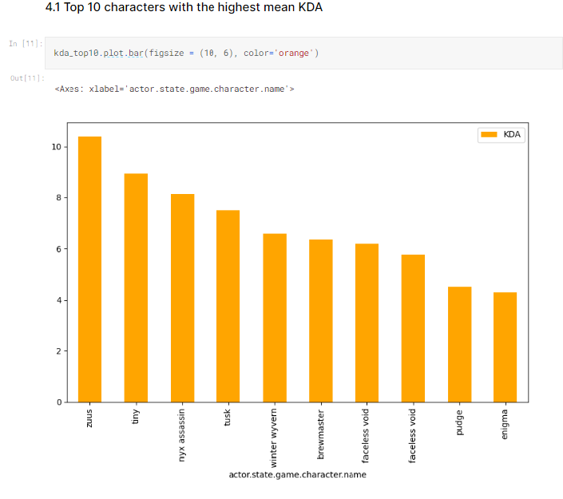

# dota-dataset-preprocessing

[Kaggle](https://www.kaggle.com/code/lizshan/dota-dataset-processing#4.-Highest-KDA-by-character)

Processing the dataset provided by [GRID Esports Datajam 23](https://grid-esports-datajam23.devpost.com/?ref_feature=challenge&ref_medium=your-open-hackathons&ref_content=Submissions+open) using Pandas. 
Further steps include training the data to build ML models using linear regression. 

## Champions with the highest KDA 
KDA (kill death assist) is calculated using the equation $(kill+assist)/death$

